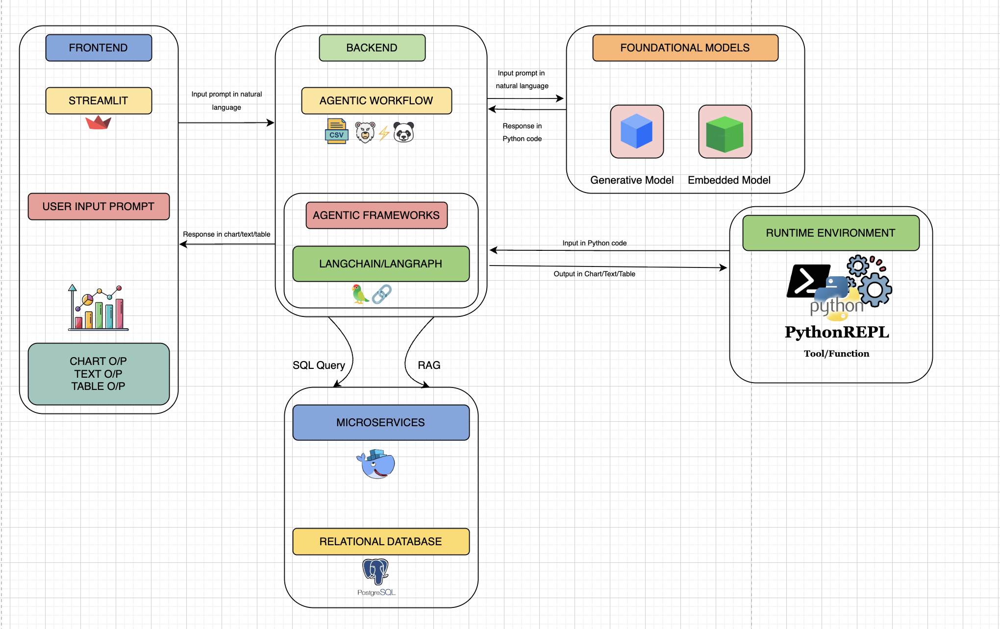
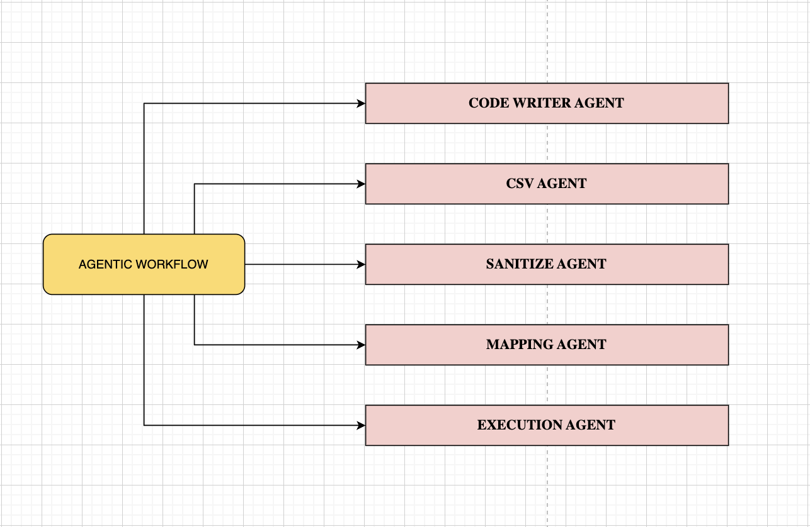
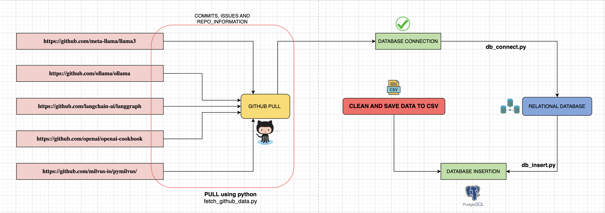

# LangChain Agentic GitHub Intelligence System

## Project Overview

This project is an end-to-end **Agentic AI Analytics System** that extracts live data from GitHub repositories, cleans and structures that data into CSV format, stores it in a PostgreSQL database, and then allows users to interact with it through a Streamlit-powered conversational dashboard.

At its core, the system uses an **agent-based architecture** built with **LangChain / LangGraph**, enabling the AI to understand user queries, map them to Python + SQL actions, execute them through a Python runtime, and finally render results as charts, tables, or text.

This system bridges the gap between raw open-source GitHub data and actionable insights using natural language.

---

## Problem Statement

Open-source repositories generate massive amounts of data: issues, commits, stars, forks, and pull requests. However, analyzing this information usually requires writing complex scripts and database queries manually.

The challenge that inspired this project was:

“How can a user analyze GitHub repository data using simple natural language without writing SQL or Python manually?”

This project solves that problem by introducing:

• Automated GitHub data extraction
• Agent-based data cleaning and structuring
• Database integration
• Natural language powered analytics
• Interactive dashboard output

All without requiring the user to manually write data processing code.

---

## System Workflow (Based on Architecture Diagrams)

### Overall Architecture

The system contains five connected layers:

1. Frontend – Streamlit UI
2. Backend – Agentic workflow logic
3. Foundational Models – LLM + Embeddings
4. Runtime – Python execution environment
5. Microservices – Database & Retrieval

User prompt flows from Streamlit → Agent → LLM → Python/DB → Streamlit charts/tables.

---

### Agentic Workflow

Multiple agents are used, each with a defined responsibility:

• csv_agent – loads and reads CSV data
• sanitize_agent – cleans and normalizes data
• table_mapping_agent – maps logic to tables
• code_writer_agent – generates Python/SQL code
• exec_agent – safely runs generated code

These agents collaborate to convert user questions into executable analytics.

---

### GitHub Data Processing Flow

The system pulls data from the following GitHub repositories:

• [https://github.com/meta-llama/llama3](https://github.com/meta-llama/llama3)
• [https://github.com/ollama/ollama](https://github.com/ollama/ollama)
• [https://github.com/langchain-ai/langgraph](https://github.com/langchain-ai/langgraph)
• [https://github.com/openai/openai-cookbook](https://github.com/openai/openai-cookbook)
• [https://github.com/milvus-io/pymilvus](https://github.com/milvus-io/pymilvus)

Python script fetch_github_data.py does the following:

• Calls GitHub API
• Gets commits, issues & repo metadata
• Cleans the data
• Saves it as structured CSV files in src/data/

Then db_insert.py inserts the data into PostgreSQL.

---

## Project Structure

Your root structure:

• images/ → architecture diagrams
• src/ → main project logic
• data/ → CSV outputs
• agents/ → agent scripts
• streamlit_app.py → UI
• db_connect.py → DB connection
• db_insert.py → CSV → PostgreSQL
• fetch_github_data.py → GitHub API pull
• utils.py → helper functions
• requirements.txt → dependencies
• setup_env_check.py → environment validator

Important folders:

• src/agents/ → contains all intelligent agents
• src/data/ → stores generated CSVs
• images/ → visual diagrams used in this README

---

## Step 1: Environment Setup

Move into your project folder:

cd langchainproject/src

Install all required packages:

uv pip install -r requirements.txt
(or: pip install -r requirements.txt)

Verify the environment:

python setup_env_check.py

If successful, you will see confirmation that all core packages are installed correctly.

---

## Step 2: Pull Data from GitHub to CSV

Set your GitHub token:

Mac / Linux:
export GITHUB_TOKEN="your_token_here"

Windows PowerShell:
setx GITHUB_TOKEN "your_token_here"

Now run the data extraction script:

python fetch_github_data.py

This will create CSV files inside:

src/data/

Examples:
• issues_meta-llama_llama3.csv
• commits_langchain-ai_langgraph.csv
• repo_info_openai_openai-cookbook.csv

These files are now ready for insertion into PostgreSQL.

---

## Step 3: Check Database Connection

Make sure PostgreSQL is running and database name is:

github_data

Test connection using:

python db_connect.py

If you see “Connection successful”, the system is ready to insert data.

Default credentials used:

host = localhost
port = 5432
dbname = github_data
user = postgres
password = postgres

You may override with environment variables if needed.

---

## Step 4: Insert CSV Data into PostgreSQL

Run:

python db_insert.py

This script will:

• Automatically create tables: issues, commits, repo_info
• Clean missing values (NaN → NULL)
• Prevent duplicate inserts
• Ignore empty CSV files

To verify, open PostgreSQL and run:

SELECT COUNT(*) FROM issues;
SELECT COUNT(*) FROM commits;
SELECT COUNT(*) FROM repo_info;

---

## Step 5: Run the Streamlit App

Now launch the frontend:

streamlit run streamlit_app.py

The browser UI will open with:

• Input box for natural language questions
• Result area for charts, tables, text

You can now test powerful analytics queries.

---

## Test Queries for This Project

Paste the following inside the Streamlit app one by one:

TEXT / TABLE QUERIES

1. Which repository has the most issues created in the last 2 months?

2. Create a table showing the total number of issues created on Monday, Tuesday, Wednesday, Thursday, Friday, Saturday, and Sunday for every repository.

3. Which day of the week has the highest number of issues created across all repositories?

4. Which day of the week has the highest number of issues closed across all repositories?

CHART QUERIES

5. Plot a line chart showing the total number of issues created over time for all repositories.

6. Create a pie chart showing the percentage distribution of issues created among all repositories.

7. Create a bar chart showing the number of stars for each repository.

8. Create a bar chart showing the number of forks for each repository.

9. Create a weekly bar chart showing the number of issues closed for each repository.

10. Create a stacked bar chart showing issues created and issues closed for each repository.

FORECASTING / AI QUERIES

11. Use Prophet to forecast the number of issues created for each repository over the next 30 days.

12. Use Prophet to forecast the number of issues closed for each repository over the next 30 days.

13. Use Statsmodels to forecast the number of pull requests for each repository over the next 30 days.

14. Use Statsmodels to forecast the number of commits for each repository over the next 30 days.

---

## Final Summary

This project demonstrates a complete AI-driven developer analytics pipeline:

• GitHub → CSV → PostgreSQL
• Agents + LangChain + Python
• Natural Language → Code → Database → Visualization
• Streamlit interface for human interaction

It serves as a strong proof of concept for:

✅ AI-powered data pipelines
✅ Automated analytics
✅ Agentic system design
✅ Developer intelligence platforms

